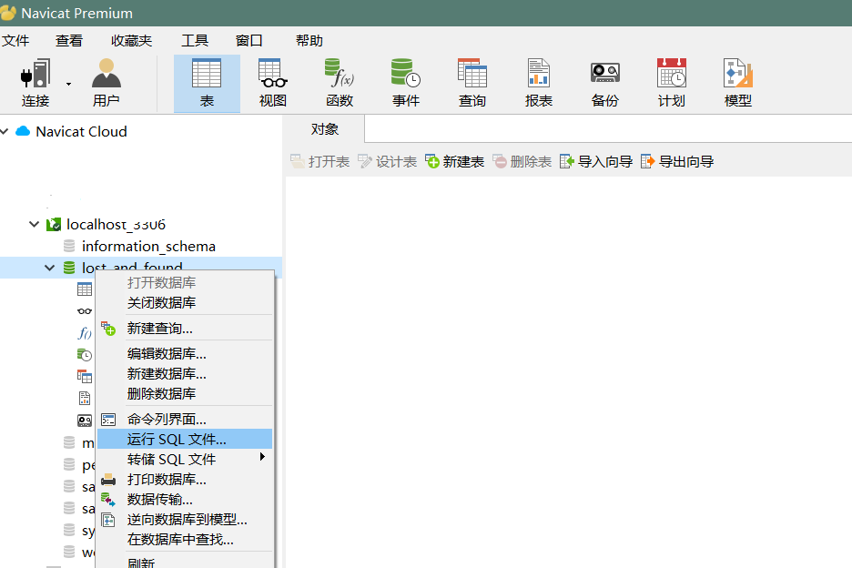
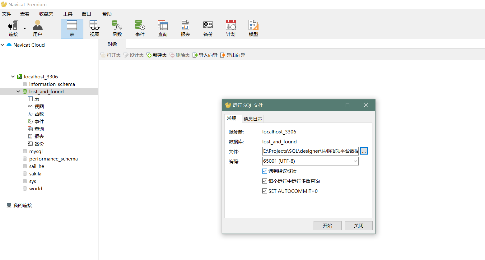
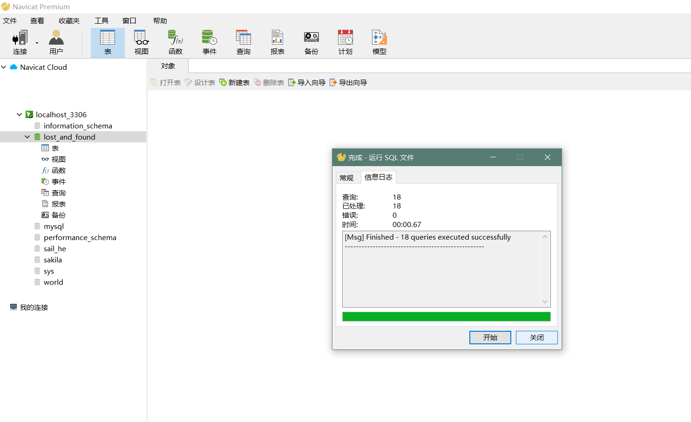
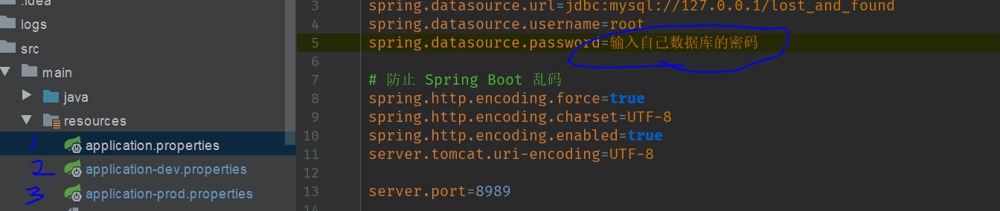

# 失物招领
**软件工程程序设计-JavaWeb**

### 前端
* Html5
* CSS3
  - Bootstrap
* javascript
  - Jquery
  - Ajax
### 后端
* MVC 软件架构模式
* SpringMVC
* SpringBoot 1.5.8
* Jpa
* hibernate 3.2+

# 开发工具
IntelliJ IDEA
# 版本控制工具
Git
# 软件项目管理及自动构建工具
Maven

# 建模和设计解决方案
PowerDesigner 15
# 数据库
MySQL 6.3
# 数据库管理软件
Navicat 11.2.7
# 目标浏览器
chrome 58及以上(其余未作测试)

# Documentation
./docs目录中包含了开发文档:
1. docs/database: 数据库设计文档
2. 软件需求文档, 使用 Win office

# 上手教程:
`B` - 初学者, `A` - 经验者
*  `B` git教程 https://www.cnblogs.com/schaepher/p/5561193.html
*  `B` 
*  `B` 
*  `B` 
*  `A` 本地数据库: 在数据库管理软件中运行sql文件(若存在release版的sql文件, 请优先运行, 数据库名务必为lost_and_found)
*  `A` 鼠标右击数据表，刷新
*  `B` 
*  `B` 更改这三处为自己本地的数据库密码, 运行成功后浏览器输入localhost:8989, 首次运行应自动跳转至登录页面
* PS: git虽然可以托管office系列文件 但不要在文件打开的同时进行pull操作(虽然不会引起不可逆的错误)
